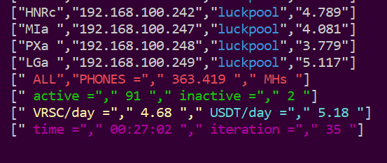

# api summary
## adds summary for all miners - based on Oinks-API monitoring for ccminer

https://github.com/Oink70/Android-Mining/tree/main/monitoring

read Oink's README.md first!!

thx Oink :D

tailored to my needs, each miner is now in MHs (mega hash / s)

customization requires some prior programming knowledge

+ Rdeče besedilo
**no help, use at your own risk**
+ Zeleno besedilo
**if you don't know what to do, don't do anything**
- Zeleno besedilo

______________
## config.json

```
allows access for this IP range. Adjust to your own situation.
"api-allow": "192.168.xxx.0/24",
enables the API by making it listen on the specified IP address and port. 0.0.0.0 signifies all adapters and IPs.
"api-bind": "0.0.0.0:4068"
```
______________
## spisek.list

contains the last term of the miner's IP (aaa.bbb.ccc.XXX) and name of that miner, one per line

e.g.:
```
110  S9a
111  S9b
etc.
```
______________
## watch.sh

change refreshing time (depending on the number of devices)

______________
## watch-screen.sh

change pool names (as you have set in config.json) and colors

______________
## check-all

change to your IP and port

______________
## set up aliases
```bash
alias wa='~/watch.sh'                                      # start
alias rwa='screen -x Watch'                                # show screen
alias xwa='screen -S Watch -X quit 1>/dev/null 2>&1'       # stop screens
alias sl='screen -ls'                                      # list screen's
```

______________
## example


