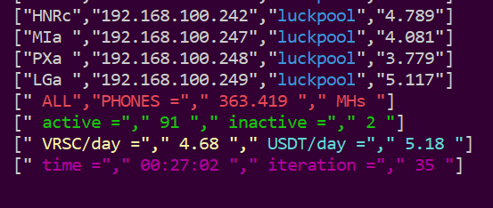
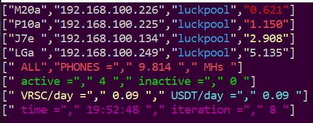

# api summary
## adds summary for all miners - based on Oinks-API monitoring for ccminer
displays:
- sum of all miners hashrate
- number of active and inactive miners
- assumed revenue in VRSC and USDT
- output time and number of output iterations (for performance control)

additionally:
- colors the different pools in different colors
- specially colors all hashrates that are less than 1, 2 or 3 MHs

______________

https://github.com/Oink70/Android-Mining/tree/main/monitoring

read Oink's README.md first!!

thx Oink :D

tailored to my needs, each miner is now in MHs (mega hash / s)

customization requires some prior programming knowledge

you definitely need this:
`sudo apt-get update`
`sudo apt-get upgrade -y`
`sudo apt install python3 -y`
`sudo apt install python3-pip -y`
`sudo pip3 install requests`
`sudo apt install nano screen bc -y`


**no help, use at your own risk**

**if you don't know what to do, don't do anything**

______________
## config.json

```
allows access for this IP range. Adjust to your own situation.
"api-allow": "0.0.0.0/0",
enables the API by making it listen on the specified IP address and port. 0.0.0.0 signifies all adapters and IPs.
"api-bind": "0.0.0.0:4068"
```
______________
## device.list

make a new file with `nano device.list` containing the IPs of the miners (xxx.xxx.xxx.xxx) and the name of that miner separated by one tab or space, one per line, add a blank line at the end of the file

e.g.:
```
192.168.100.110  Miner
127.1.0.111  Worker
etc.

```
______________
## watch.sh

change refreshing time (depending on the number of devices)

______________
## watch-screen.sh

change pool names (as you have set in config.json) and colors

______________
## check-all

change to your port

______________
## set up aliases
```bash
alias wa='~/watch.sh'                                      # start
alias rwa='screen -x Watch'                                # show screen
alias xwa='screen -S Watch -X quit 1>/dev/null 2>&1'       # stop screens
alias sl='screen -ls'                                      # list screens
```

______________
## example





